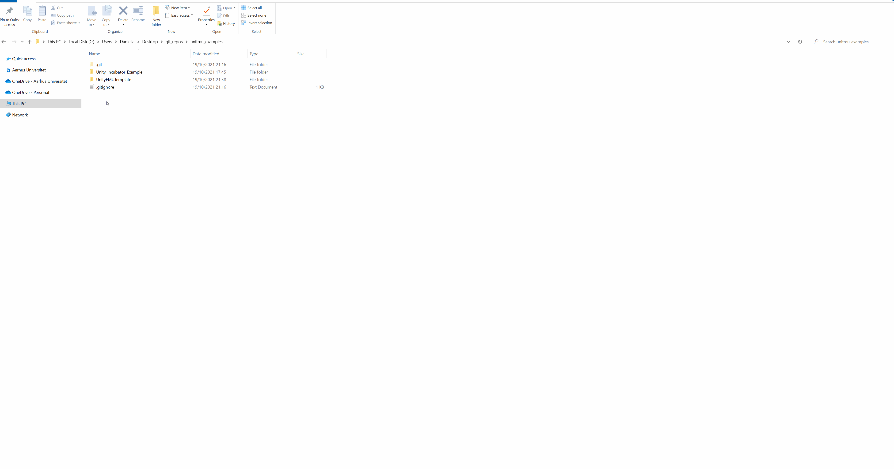
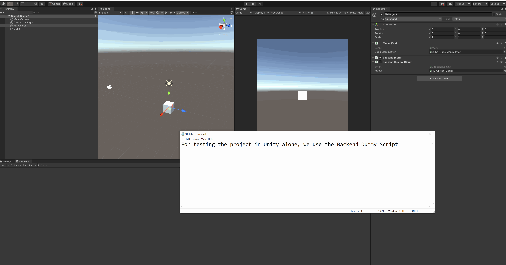

# Unity FMU template

This is a Unity FMU template which consists of a single Cube GameObject which position can be manipulated through FMI.

## Generate Unity FMU using this template
This template can be used to generate Unity FMUs, by:

* Opening the Unity Project at: resources/UnityFMUProject (can be opened using Unity Hub).
* Making the desired modifications, i.e. add GameObjects, 3D shapes etc.
* If any variables must be available to the FMU, these variables should be added to the Model.cs class as properties with set and get functions. 
* Once the desired modifications are made, and the necessary variables are added to the Model.cs class, the Unity Project can be built. For ease of use, build the solution to a _Build_ directory within the Unity project. Remember to uncheck the BackendDummy.cs and check the Backend.cs to setup the FMI backend.
* Open the launch.toml file (located in the resources folder), and ensure the launch command for the specific OS is pointing to the correct Unity executable that has just been built.
* Modify the _modelDescription.xml_ file to include the new variables added to the Unity FMU.
* Test the FMU using fmpy:
    
    * Open a command prompt
    * If fmpy is not installed, install it using pip: _pip install fmpy_
    * Run: _python -m fmpy.gui_
    * Drag the FMU folder into the GUI
    * Configure the variables or simulation time, and run the FMU. If an error occurs, it will be outputted on the command prompt, where fmpy was started from. If everything goes well, the FMU should run and the built Unity application will run.

## How the template is set up

For supporting the C# libraries used by UniFMU, these packages must be included in Unity. 
In this template we chose to use the [NuGet package manager](https://github.com/GlitchEnzo/NuGetForUnity) for installed the necessary packages:

* Newtonsoft.Json
* NetMQ
* CommandLineParser
* Google.Protobuf

The Unity project is set to use the _.NET4.x_ standard.

The project contains a GameObject (in this example, called FMIObject) used for communicating with the unifmu wrapper. 
It contains three scripts: Backend.cs, BackendDummy.cs, and Model.cs.
The Model.cs is a MonoBehaviour class used to set and get the variables of GameObjects in the Unity project. 
These variables are exposed to the FMU, meaning they must also be specified in the modelDescription.xml of the FMU.
The Backend.cs is used to setup the communication with the unifmu wrapper, and calls the appropriate FMI functions on the Model.cs.
The BackendDummy.cs is used to test the project in Unity alone, not as an FMU. 
This allows testing all the Unity specific parts of the FMU, without the need of building the project and running it as an FMU.

Testing the unity project standalone:

Building the unity project to an FMU:

## Build to different operating systems

It is also possible to build the unity project to different operating systems, e.g. MacOS or Linux.

To do this, you need to open Unity Hub -> Installs -> Click on the three vertical dots on the Unity Installation -> Click Add Modules -> Mac Build Support (Mono)

You can also choose Windows or Linux depending on your needs. Then you have the possibility to build the project to the installed operating systems.
